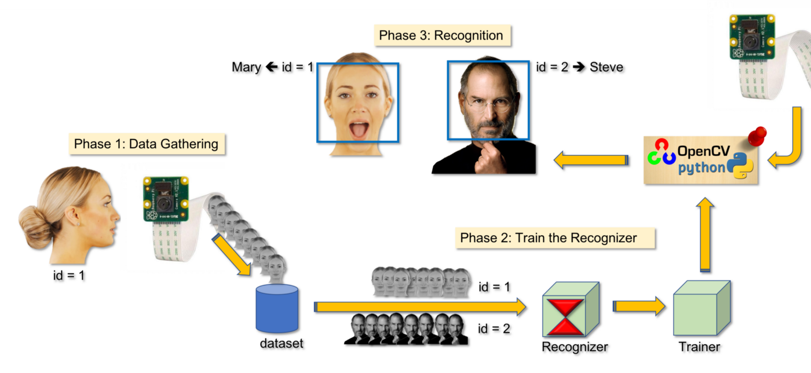
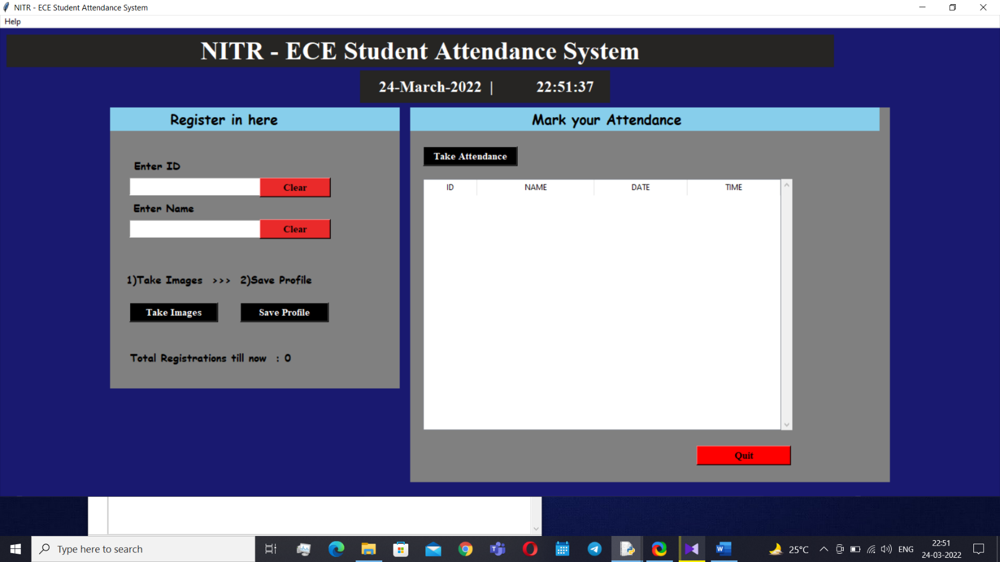
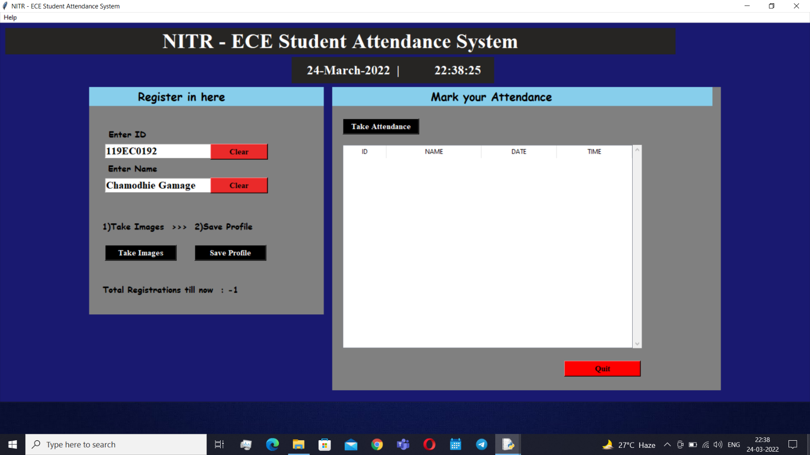

# Face-Recognition-based-Attendance-Marking-System
The management of the attendance can be a great burden on the teachers if it is done by hand. To resolve this problem, smart and auto attendance management system is being utilized. But authentication is an important issue in this system. The smart attendance system is generally executed with the help of biometrics. Face recognition is one of the biometric methods to improve this system. Being a prime feature of biometric verification, facial recognition is being used enormously in several such applications, like video monitoring and CCTV footage system, an interaction between computer & humans and access systems presents indoors and network security. By utilizing this framework, the problem of proxies and students being marked present even though they are not physically present can easily be solved. The main implementation steps used in this type of system are face detection and recognizing the detected face.

<h3>To create a complete project on Face Recognition, we worked on 4 very distinct phases:</h3>

- Face Detection and Data Gathering
- Train the Recognizer
- Face Recognition
- Marking attendance

<h5>Screenshots of my final project output have included in the below table.</h5>

 |  |
| :---: | 
|  |
|Front end Graphical User Interface|
|  |
| Registering a new student by giving required details |
|  |
| Taking the images for the registration process (with spectacles) |
|  |
| Taking the images for the registration process (without spectacles) |
|  |
| Succesfully saved profile |
|  |
| Taking the attendance of a registered student |
|  |
| Attendance Record after succesfully taking the attendance |
|  |
| Taking the attendance of an unregistered student |
